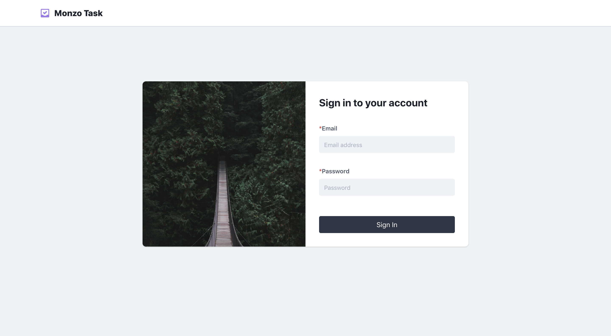

<h1 align="center">
  Monzo web engineering task
  <br>
</h1>

<p align="center">
    
    
    
    
</p>
<h4 align="center">Monzo web engineering task with React 16.9 and Redux</h4>


- This repo holds the entire front end code base for Monzo web engineering task. The code is written in React 16.9 and Redux.
- This repo was webpack and other configs are inspired from CRA(CREATE-REACT-APP).
- For styling we are using tailwind css.
- Test cases are written in mocha and pupetter for e2e tests.

**Features Implemented**:
<!-- add "N/A" to the end of each line that's irrelevant to your changes -->
<!-- to check an item, place an "x" in the box like so: "- [x] Documentation" -->
- [x] Redirecting logged out users to the sign in form when they try to navigate to one of the routes
- [x] Style up the application
- [x] Error messaging on the form when submitted with incorrect data
- [x] Paginate the list of users
- [x] Build the app editing functionality
- [x] Make sure all functionality is covered by an E2E test and those tests pass(all pass except one)
- [x] Make the app more performant
- [x] Convert the components into re-usable components
- [x] Implement coding standards e.g. ESLint, Prettier
- [x] Web accessibility best practices(partially added)
- [x] Update any out-of-date packages
- [x] Appropriate metadata for each route e.g. page title, page metadata

**Features Missing**:
1) One of the e2e test is not passing even though the functionality is correct.
2) No type checking added
3) Improve web accessibility further


## 📦 Table of Contents

1.  [Requirements](#requirements)
2.  [Installation](#getting-started)
3.  [Running the Project](#running-the-project)
4.  [Project Structure](#project-structure)
5.  [Routing](#routing)
6.  [Development Tools](#development-tools)
7.  [Building for Production](#building-for-production)
    - [Deployment](#deployment)

## 💼 Requirements

- node `^10.4.0`
- yarn `^1.10.1` or npm `^6.1.0`

## 💾 Installation

After confirming that your environment meets the above [requirements](#requirements), you can start this project by following the steps mentioned below:-

```bash
$ git clone https://github.com/vivek12345/web-engineer-exercise
$ cd web-engineer-exercise
```

When that's done, install the project dependencies. It is recommended that you use npm for deterministic. `npm install` will suffice.

```bash
$ npm install # Install project dependencies (or `npm install`)
```

### For starting the react server

```bash
$ npm start # Build the client bundles and start the dev server
```


While developing, you will probably rely mostly on `npm start`; however, there are additional scripts at your disposal:
```

|`npm <script>`                                |Description|
|-----------------------------------------------|-----------|
|`npm start`                                   |Starts node app at `localhost:3000` by default|
|`npm run eslint:fix`                          |Runs all eslint fixes|
|`npm test`                                    |Runs all e2e tests|
```

## ✏️ Project Structure

The project structure using CRA directory structure where folders are grouped into containers and components and since we are using redux, we do have actions, reducers,, store and helpers.
This structure is only meant to serve as a guide, it is by no means prescriptive. That said, it aims to represent generally accepted guidelines and patterns for building scalable applications.
To understand what goes inside components and what inside containers, please check out this [component-state-vs-redux-store](https://medium.com/netscape/component-state-vs-redux-store-1eb0c929277) by [Vivek Nayyar](twitter.com/viveknayyar09).

```
├── build                                       # All production ready files with minified JS, html and css files
├── config                                      # All CRA related config goes here including paths, environment variables and │jest config goes here
├── public                                      # Static public assets used while in dev mode
├── scripts                                     # All webpack related code
│   ├── build.js                                # Script for making production bundle
│   ├── start.js                                # Script for development mode
│   ├── test.js                                 # Script for test mode
├── src                                         # Client Application source code
│   ├── helpers                                 # All api helpers, utils, local storage, analytics and config helpers go inside this folder
│   ├── components                              # Global Reusable Components
│   │   ├── ComponentName                       # Component Name Folder and every component will have a index.js and css file
│   │   │   ├── index.js                        # Main file which exports the component
│   │   │   ├── ComponentName.js                # Main component code
│   ├── containers                               # Top level pages container
│   │   ├── ContainerName                        # Pages Folder and every page will have a index.js and css file
│   │   │   ├── index.js                        # Main file which exports the page
│   │   │   ├── ContainerName.js                # Main page/container code
│   ├── assets                                  # Any images, fonts and icons which need to be cache bursted go here
│   ├── index.js                                # Application bootstrap and rendering
│   ├── constants                               # Folder for constants file
│   ├── Routes.js                               # All application client side routes using react-router
├── env                                         # All environment variables to be configured from here
│   ├── properties.sample.env                   # Sample file for setting up environment vars
├── .babelrc                                    # Babel file for es6 and react code transpilation
├── .gitignore                                  # The name says it all
├── .eslintrc.js                                # This file maintains all end points of the back end routes
├── .prettierrc                                 # Prettier config
├── package.json                                # All npm dependencies can be found here
├── README.md                                   # Readme file for the whole app
├── yarn.lock                                   # Yarn lock file for locking the dependency versions
```

## 🚀 Routing

We use `react-router` [route definitions](https://github.com/ReactTraining/react-router)
See the [project structure](#project-structure) section for more information.

## ⚙️ Development Tools

### Prettier

- We use `prettier` for code formatting.Here is the link to downlod the same.[Prettier](https://www.npmjs.com/package/prettier)

- Make sure you are using vscode and your vscode user_settings has the following code:-

```bash
{
    "editor.fontSize": 12,
    "editor.formatOnPaste": true,
    "editor.formatOnSave": true,
    "prettier.eslintIntegration": true,
}
```